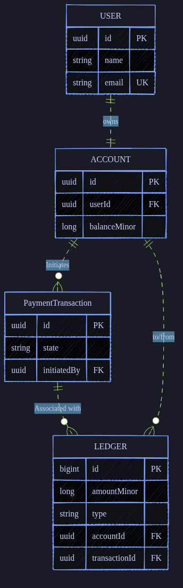
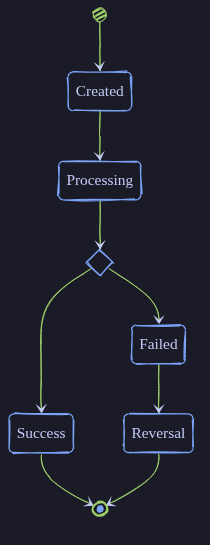

My goal is to become a software architect. And the first step towards that? Becoming a really solid backend engineer.

So naturally, in my infinite wisdom, I asked ChatGPT for project ideas. I know, I know, but hear me out, because this one's actually a gem.

Build a fake bank.

Banking systems force you to care about correctness. For example, in a social media app if your system has a bug that causes a few likes to disappear no one will care that much. But if even ₹100 (~$1) is lost it'd be catastrophic. Hence we'll have to make it as resilient as possible.

The topics we can cover: DB design, architecture decisions, event streaming, idempotency, retries, crash recovery, timeout handling, ledger systems, reconciliation... the list keeps going. It's one of those projects that looks simple on the surface and then quietly humbles you.

This series is me building it in public, figuring things out as I go. If something breaks, you'll hear about it. If I make a questionable decision, I'll explain why I made it anyway. No polished hindsight, just the actual journey.

# So, how this series works?
I'll try to focus more on the backend part instead of the framework itself, it's Spring Boot.

One thing before we start. As this is a learning project. If you are following along I'll urge you to use AI as a replacement for Stack Overflow not for writing code, even parts of it.

> **TIP:** add `Act as socratic teacher` at the end of your prompt. it's better for learning purposes but I still feel it sometimes explains too much. But hey, it's a free upgrade, I'll take the deal any day.

# What are we building?
It's going to be a short project. Hopefully.

We are going to make a double accounting system. Which consists of: Payment/Transaction handler, ledger system (the source of truth for all money movement) and a settlement service. Also the user, and account is a must. I mean how else we show movement of funds.

And yes, there will be tests I'll be using AI for those. Yes, I absolutely despise writing test cases.

We'll be using DDD architecture for our project not the typical MVC taught as the first step when learning Spring Boot. 

I have decided to keep users and their accounts separate because in future there might be multiple accounts for one user. Then every account can serve different purpose.

Transaction gets its own service, db, etc. As we will need logging, audits(soon) I have decided to keep it separate.

As ledger is the source of truth account balance will be cached and they'll also be holding more info for future ledger to balance calculations, such as the last ledger processed.

After all the basics are done we'll focus on kafka and later reconciliation.

# The schema
So, I have designed a rough schema for now. We'll update it as needed along the way.

As you can see in the attached schema diagram, we'll be having 4 entities: User, Account, PaymentTransaction, Ledger.

The id we will be using is UUIDv7 except for ledger. Why?
- Ledger doesn't have uuid for its Primary Key because it will always be an internal record. All the others are exposed to the user hence the need for the uuid
- We will be using UUIDv7 because it's timebased, which means all the ids will be in order. Making indexing easier than UUIDv4, which is the default behaviour for spring applications.

You might have noticed that the balance is not just balance but balanceMinor. Why? The infamous rounding off problem: 0.1+0.2!=0.3, we can't directly use the float datatype. Next best option is int but it has smaller limit than long. Hence, I have decided to use long. As you might have already figured out, 1.01 becomes 101. There aren't any currencies as it will make the project more complex, hence we will skip it for now.

For the sake of simplicity we will calculate the balance from ledger service itself, which will be stored in account balance. We'll figure out the queue mechanism when we get there.

**PaymentTransaction will go through these states:**

First transaction is created. Afterwards it goes to processing. When processed by settlement service it either succeeds or fails. If the transaction is failed we should add reversal entries in the ledger.

# What's next
We'll get the basic Spring Boot project set up. It's going to be a really basic crud application. We'll dabble a bit into transaction idempotency.

If you spot something wrong, have a better approach, or just want to follow the chaos, drop a comment. See you in the next one.
